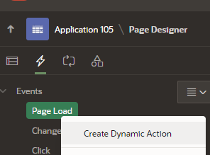

### Oracle APEX Expandable Page Item Text
In this tutorial we will illustrate one way to create expand/collapseable text inside a page item in Oracle APEX. The demonstration was developed on Oracle Autonomous Transaction Processing leveraging Oracle APEX 23.2.1. This tutorial assumes some basic APEX knowledge is present. That a user has a workspace, the ability to create an application and page inside the application.

## Step 1: Watch Youtube Demonstration
To start we reccomend watching the following youtube video before following the instructions below. 
[ Add Link](Add Label)

## Step 2: Follow Steps to Create Expand/Collapsable page Item

- Access or create a new application and page in APEX. (Assumed knowledge.)

- Create a new region on your page.


- Add a Display Only page item.


- Rename your Region to Article.
 

- Rename your page item to P7_Article, remove the Label text and set format to HTML. 


- Click on the lightning bolt and create a new Page Load dynamic action to seed the default value of the text in the page item. 


Name your dynamic action. 


- Name the true action "seedArticle" and set the action to set value. 


- Set the page item to your text field and make sure your Fire on Inialization is set to true.  


- Set the Type to SQL query. We will now create a query to get the first 100 characters of our varchar2 or clob we wish to display. To keep it simple we will select text from dual. But this could be a column in your table. 


Paste in this query.  

```
select SUBSTR('The Sluggers 2023 fall season was the teams'' seventh together and by far the teams most successful.The 13u Sluggers team began the season by acquiring two new players PW and CJ. The additional OF and IF depth helped early on as the team faced many injuries, and as the team adjusted to the 60-90 field dimensions. The team played in three tournaments along with a full NVTBL season. In tournament play, the team finish with a 8-4 record placing second in both the Zombie Apocalypse and Winchester Field of Screams tournamentsl. For the season the team batted .327 across 26 games scoring a record 220 runs averaging 8.4 per game. The team improved considerable pitching with a team ERA of 4.16 allowing 4.9 runs per game while pitching seven players ten or more innings in the season. The season ended with a 18-8 record setting the stage for a great spring 2024 season.',0,100)||'... '||'<a href="#" onclick="console.log(''More Clicked Firing dynamic action to show all text.'');$.event.trigger(''showFullText'');">Read More</a>' as "Article" from dual
```
Pleae note that this query includes HTML like below that will on-click spawn a Jquery event that will return the full article. We will build this event in a moment. 

```
<a href="#" onclick="console.log(''More Clicked Firing dynamic action to show all text.'');$.event.trigger(''showFullText'');">Read More</a>
```

- Run your page in the APEX application. You should see the following. 


- Now we will create a new custom action to modify the the page item to display the entire article. Navigate back to your APEX development screen right click on events and create a new Dynamic Action.


- Now we will name the dynamic action "showAllText". Under the When dropdown set the Event type to "Custom", name the custom event "showFullText". Set the Selection Type to "Javascript Expression" and type in the word "document" in the expression field. Please note that the word document apply the Jquery function to the entire document itself when triggers. 


The Custom Event name, in this example showFullText is the name we will trigger in our html link. 
```
$.event.trigger('showFullText');
```

- Click on your true event. Modify the following fields. 
Set the Name to "showAllText".
Set Action to "Set Value".
Make sure the Escape Special Characters is set to false. 
Set the Item(s) to be set to your text field, in this example P7_article. 
Make sure Fire on Initialization is set to false. 


Last but not least paste in the query below. This will query your article and return all the text with a read less link at the bottom to return to the shorter article. 

```
select 'The Sluggers 2023 fall season was the teams'' seventh together and by far the teams most successful.The 13u Sluggers
 team began the season by acquiring two new players PW and CJ. The additional OF and IF depth helped early on as the team faced 
 many injuries, and as the team adjusted to the 60-90 field dimensions. The team played in three tournaments along with a full 
 NVTBL season. In tournament play, the team finish with a 8-4 record placing second in both the Zombie Apocalypse and Winchester 
 Field of Screams tournamentsl. For the season the team batted .327 across 26 games scoring a record 220 runs averaging 8.4 per game. 
 The team improved considerable pitching with a team ERA of 4.16 allowing 4.9 runs per game while pitching seven players ten or more innings
  in the season. The season ended with a 18-8 record setting the stage for a great spring 2024 season.'
||'<br><a href="#" onclick="console.log(''More Clicked Firing dynamic action to min text.'');$.event.trigger(''showLessText'');">Read Less</a>' as "Article" from dual
```

- Run your page, click on the read more button. You should see the full article appear. Next we will wire our Read Less button to return to the prior state. 


- Create another dynamic action. 


- Set the name to "showLessText". Set the event type to "custom". Set the Custom Event name to "showLessText". Set the selection type to Javascript Expression and the Javascript Expression field to document. 


- Navigate to the true action. Much like before we name it "showLessText". Set the action as set Value. Set both Escape special characters and fire on initialization to false. Set the Item to set to P7_Article.


Last but not least set our query to the one below. Please notice this query matches our intial one on page load, only it fires on-click as opposed to page load. 

```
select SUBSTR('The Sluggers 2023 fall season was the teams'' seventh together and by far the teams most successful. 
The 13u Sluggers team began the season by acquiring two new players PW and CJ. The additional OF and IF depth helped early
 on as the team faced many injuries, and as the team adjusted to the 60-90 field dimensions. The team played in three 
 tournaments along with a full NVTBL season. In tournament play, the team finish with a 8-4 record placing second in both
  the Zombie Apocalypse and Winchester Field of Screams tournamentsl. For the season the team batted .327 across 26 games
   scoring a record 220 runs averaging 8.4 per game. The team improved considerable pitching with a team ERA of 4.16 allowing
    4.9 runs per game while pitching seven players ten or more innings in the season. The season ended with a 18-8 record
     setting the stage for a great spring 2024 season.',0,100)||'... '||
     '<a href="#" onclick="console.log(''More Clicked Firing dynamic action to show all text.'');$.event.trigger(''showFullText'');">Read More</a>' 
     as "Article" from dual
```

- Run your page again. Click Read more, then read less. You should see your page item dynamically refresh. 


