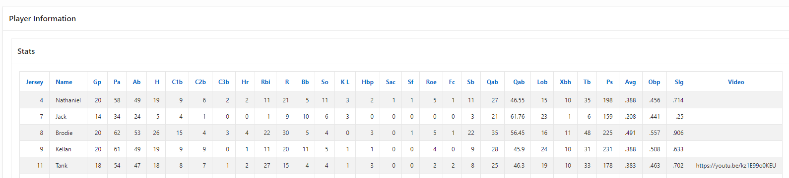
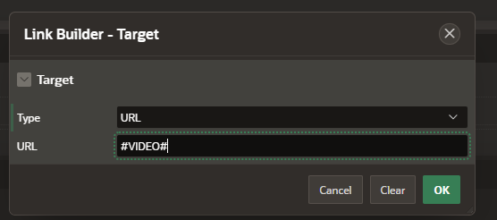
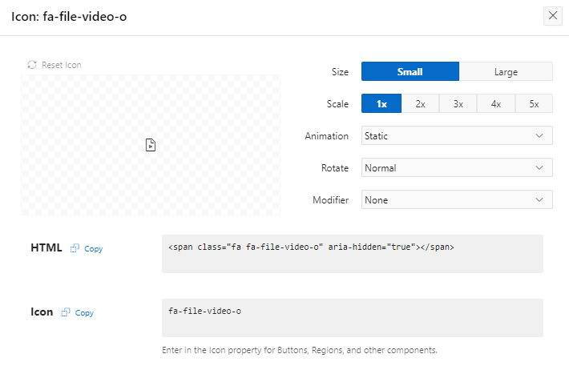
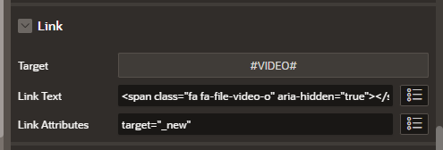
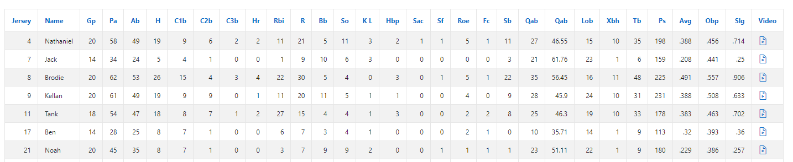
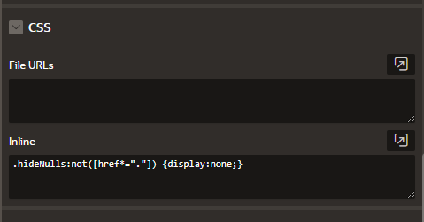
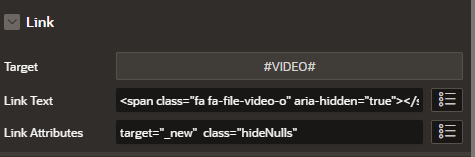
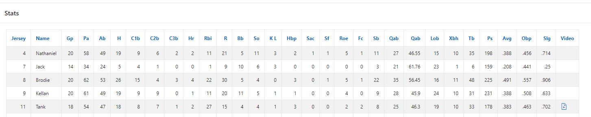

## How to Leverage CSS selectors to Hide null Links in APEX Reports

In this example we will show you how to leverage CSS selectors inside APEX classic reports to hide null values. We will start with a classic report that has a url inside one of the columns but has a number of null values. 

We reccomend watching this video as the guide for the steps below. [How to Remove Null Links Inside APEX Reports with CSS Selectors](https://youtu.be/vyxFeww1XyM)



Next we will convert this column to a link and leverage the APEX icon catalog to transform the url into a clickable image. 


The APEX icon library can be found here.

[APEX Video Icon](https://apex.oracle.com/pls/apex/r/apex_pm/ut/icons)



Code for span tag leveraged in video

```
<span class="fa fa-file-video-o" aria-hidden="true"></span>

target="_new"
```


Your report at this point will display icons for all the rows even if the value is null. 



Now we will take a look at how to quickly create a CSS selector that will remove the icon if the value of the href is not a url. There are many ways to create a selector, in this example we will leverage the premise that a properly formed url will contain at least one period in the url. Additional CSS Selectors could also be applied if further checks were necessary. 

- Example CSS Selector text. 

```
.hideNulls:not([href*="."]) {display:none;}
```

CSS is added to the page level. 



CSS is then applied to the link in the report. 



Final report



Some other CSS Selector code that may be of interest to hide null href. 
A[href=""], A[href="#"] {display: none;}