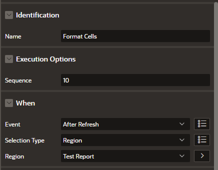
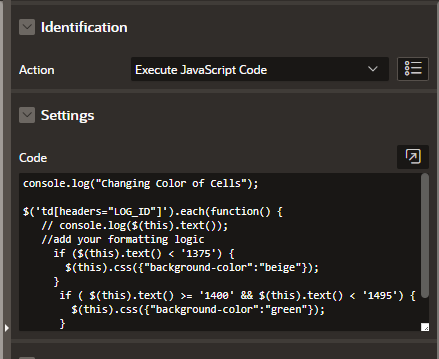
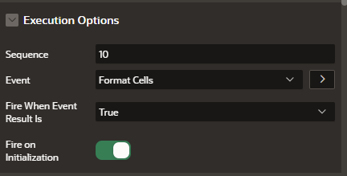

# Example Jquery for customizing a single cell inside a Classic Report

- Create a dynamic action on the classic report. Set the following attributes



- Create a true action of type Execute Javascript Code



- Set the flag to fire on initialization.



- Insert this code into the Javascript window. 

```
console.log("Changing Color of Cells");

$('td[headers="LOG_ID"]').each(function() {
   // console.log($(this).text());
   //add your formatting logic
     if ($(this).text() < '1375') {
       $(this).css({"background-color":"beige"});
     }
      if ( $(this).text() >= '1400' && $(this).text() < '1495') {
        $(this).css({"background-color":"green"});
      }

});
```
