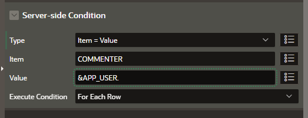
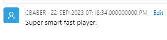

## Intro to Oracle APEX Comments Theme Component - 101
Please watch the following video first before proceeding with the code below.
[Intro to the APEX Comments Theme Component Video](https://youtu.be/4Dl6_2wX-oE)

-- Below is a static query used in the video above for the comments 
```
select 13 id, 
       (sysdate-2) comment_date,
       lower(APEX_CUSTOM_AUTH.GET_USERNAME) user_name,
       'He really barrelled up this pitch. ' comment_text,
       'https://youtu.be/FbBq5-oaWU4' attribute_1, 
       'https://ayxzx2tnd0tqzed-sluggersapex.adb.us-ashburn-1.oraclecloudapps.com/ords/r/searchdemo/105/files/static/v7/baseballcards/tank.png' attribute_2
from dual
union all
select 14 id, 
       (sysdate) comment_date,
       'Coach Bill' user_name,
       'Excellent timing on the pitch, with good eye hand contact.' comment_text,
       ' ' attribute_1, 
       ' ' attribute_2
from dual
```

- Example HTML Code for the attributes section of the comments section. 
```
<a href="&ATTRIBUTE_1." target="_new">

&nbsp;
&ATTRIBUTE_1.</a>
```

## Building Row Level Comments on a Report with the Oracle APEX Comments Theme Component 

Please watch the following video before proceeding through the sample Code below. [Add](https://add) The following steps were performed in an Oracle Autonomous Database on a free tier account leveraging APEX 23.1.2 at the time of the recording. 

- Navigate to SQL Worshop -> SQL Commands and execute the following to create a new table to hold our comments. Please note this is a sample table with the basics for the comments theme component. Highlight each command and click run or copy and paste one at a time. We will also create a teamstats table as illustrated in the video above. 


```
  CREATE TABLE "COMMENTS" 
   (	"C_ID" NUMBER GENERATED BY DEFAULT ON NULL AS IDENTITY MINVALUE 1 MAXVALUE 9999999999999999999999999999 INCREMENT BY 1 START WITH 1 CACHE 20 NOORDER  NOCYCLE  NOKEEP  NOSCALE  NOT NULL ENABLE, 
	"PLAYER_ID" NUMBER NOT NULL ENABLE, 
	"COMMENTER" VARCHAR2(150) COLLATE "USING_NLS_COMP", 
	"COMMENT_DATE" TIMESTAMP (6),  
	"COMMENT_TEXT" VARCHAR2(6000) COLLATE "USING_NLS_COMP", 
	"ACTIONS" VARCHAR2(250) COLLATE "USING_NLS_COMP", 
	"ATTRIBUTE_1" VARCHAR2(6000) COLLATE "USING_NLS_COMP", 
	"ATTRIBUTE_2" VARCHAR2(6000) COLLATE "USING_NLS_COMP", 
	"ATTRIBUTE_3" VARCHAR2(6000) COLLATE "USING_NLS_COMP", 
	"ATTRIBUTE_4" VARCHAR2(6000) COLLATE "USING_NLS_COMP", 
	 CONSTRAINT "COMMENTS_PK" PRIMARY KEY ("C_ID")
  USING INDEX  ENABLE)  DEFAULT COLLATION "USING_NLS_COMP" ;

   COMMENT ON COLUMN "COMMENTS"."C_ID" IS 'primary key for each comment';
   COMMENT ON COLUMN "COMMENTS"."PLAYER_ID" IS 'foreign key connecting to the player id';
   COMMENT ON COLUMN "COMMENTS"."COMMENTER" IS 'name of person making comment';
   COMMENT ON COLUMN "COMMENTS"."COMMENT_DATE" IS 'date of comment';
   COMMENT ON COLUMN "COMMENTS"."COMMENT_TEXT" IS 'text of comment';
   COMMENT ON COLUMN "COMMENTS"."ACTIONS" IS 'freeform actions field';
   COMMENT ON COLUMN "COMMENTS"."ATTRIBUTE_1" IS 'freeform attribute field';
   COMMENT ON COLUMN "COMMENTS"."ATTRIBUTE_2" IS 'freeform attribute field';
   COMMENT ON COLUMN "COMMENTS"."ATTRIBUTE_3" IS 'freeform attribute field';
   COMMENT ON COLUMN "COMMENTS"."ATTRIBUTE_4" IS 'freeform attribute field';
   COMMENT ON TABLE "COMMENTS"  IS 'example table for comments';

CREATE TABLE "TEAMSTATS" 
   (	"ID" NUMBER GENERATED BY DEFAULT ON NULL AS IDENTITY MINVALUE 1 MAXVALUE 9999999999999999999999999999 INCREMENT BY 1 START WITH 1 CACHE 20 NOORDER  NOCYCLE  NOKEEP  NOSCALE  NOT NULL ENABLE, 	"JERSEY" NUMBER, 	"NAME" VARCHAR2(100) COLLATE "USING_NLS_COMP", 
	"GP" NUMBER, 	"PA" NUMBER, 	"AB" NUMBER, 	"H" NUMBER, 	"C1B" NUMBER, 	"C2B" NUMBER, 
	"C3B" NUMBER, 	"HR" NUMBER, 	"RBI" NUMBER, 	"R" NUMBER, 	"BB" NUMBER, 	"SO" NUMBER, 
	"K_L" NUMBER, 	"HBP" NUMBER, 	"SAC" NUMBER, 	"SF" NUMBER, 	"ROE" NUMBER, 	"FC" NUMBER, 
	"SB" NUMBER, 	"QAB" NUMBER, 	"QAB_" NUMBER, 	"LOB" NUMBER, 	"XBH" NUMBER, 	"TB" NUMBER, 
	"PS" NUMBER, 
	"AVG" NUMBER GENERATED ALWAYS AS (ROUND("H"/"AB",3)) VIRTUAL , 
	"OBP" NUMBER GENERATED ALWAYS AS (ROUND(("H"+"BB"+"HBP")/("AB"+"BB"+"HBP"+"SAC"),3)) VIRTUAL , 
	"SLG" NUMBER GENERATED ALWAYS AS (ROUND("TB"/"AB",3)) VIRTUAL , 
	"VIDEO" VARCHAR2(2500) COLLATE "USING_NLS_COMP", 
	 PRIMARY KEY ("ID")
  USING INDEX  ENABLE
   )  DEFAULT COLLATION "USING_NLS_COMP" ;

alter table "SEARCHDEMO"."COMMENTS" add constraint
"COMMENTS_CON" foreign key ( "PLAYER_ID" ) references "TEAMSTATS" ( "ID" );
/


```

- To simplify the logic needed in our app later on we will create a trigger that on insert or update saves the APEX_USER performing the action and a timestamp of when the database action was performed. Copy and run this in SQL Commands. 


```
create or replace trigger commentsTrigger
    before insert or update 
    on comments
    for each row
begin
    if inserting then
        :new.comment_date := systimestamp;
        :new.commenter := coalesce(sys_context('APEX$SESSION','APP_USER'),user);
    end if;
    :new.comment_date := sysdate;
    :new.commenter := coalesce(sys_context('APEX$SESSION','APP_USER'),user);
end commentsTrigger;
/
```

- Lets load some sample data into the teamstats table for later use in the report. Download the sample .csv [https://github.com/chipbaber/apex_textdemo/blob/main/assets/teamstats.csv](https://github.com/chipbaber/apex_textdemo/blob/main/assets/teamstats.csv)


- Open the Object Browser in the SQL Worksheet. And select the teamstats table. 


- Click the Data Tab then load data sub tab. 


- Select the CSV file when prompted. Then click load data.
 


- The next part of this tutorial assumes the user has the knowledge to create an application, a page and a report. The tutorial starts with that in place. If you are not familiar it may be good to reference this tutorial. [https://youtu.be/bB6Yxb5uNRY](https://youtu.be/bB6Yxb5uNRY) For this example we will leverage a classic report but the same could apply to a interactive report as well. 

- Open your application and create a new page.


- Select the form option.


- Name the form, set it to be a Modal Dialog then select the comments table you created earlier. Make sure to remember the assigned page number.


- In the next prompt leave the primary key as the field c_id and create the page.


- Select the fields highlighted in green below and set there type as hidden. We are going to start with the most basic comment form we can. These fields could be leveraged at future dates for more complex comments designs. We reccomend you watch [Intro to the APEX Comments Theme Component Video](https://youtu.be/4Dl6_2wX-oE) if you need an example. 


- Right click on the Content Body and create a region. 


- Name the region, then set the type to comments. 


- Set the source table and the where clause. In our example each row in the table will represent a player ID. The where clause will filter to just the comments on that player. 


- Click on the attributes tab. Then set the comment text, user name and date fields. 


- Save your page. 


- In your comment region right click on actions and create a new action. We will use this to edit our comments.  


- For the new action set the values illustrated below. 


- Click on No link defined. Then set the following parameters. You page number should be the modal form page number you recorded earlier. We will set the comment id, to the row we want to edit, clear the cache and return to the page. 


- Next we want to set a server side condition that only displays the edit action when the logged in user was the commentor. Basically we only want to be able to edit our own comments not others. 


- Now we are ready to link your report to your comments page and form. To do this navigate in APEX to the page where your report exists. Right click on the columns drop down and create a new virtual column. 


- Name the header of the virtual column "Comments". 


- Select No Link Defined, and set it to route the page number of our midal form. Set the player_id to the #JERSEY# number, in our example the unique identifier for our comments. 


- Paste in the HTML below to create a icon for the virtual column, enabling a user to click on it. 
```
<span class="fa fa-comment-o" aria-hidden="true"></span>
```


- Save and run your page. You should see the comments icon and when clicked it will open your form to comment on the player. 


- Enter a comment, press create. Then re-open the comment window. 


- You should see your new comment. 


- Press the edit link and modify your comment. Notice the form updates and you can now edit the text. 


- Make a change and press apply. 


- Reopen to see the comment has updated. 


- If you log in as another user you can see that the edit button only appears for your comments. 

