# How to Set Up Cline to Access Oracle Generative AI LLMs

This guide shows how to connect Cline to Oracle Generative AI by using an Oracle Generative AI API key and an OpenAI-compatible endpoint.

> **Note:** Please watch the accompanying video [https://youtu.be/ZhFmOjUU3AE](https://youtu.be/ZhFmOjUU3AE) before proceeding. The instructions below are intended as a high-level supplement to the video.

## Prerequisites

Before you begin, make sure you have:

- Access to an Oracle Cloud Infrastructure tenancy with Oracle Generative AI enabled.
- Permission to create Generative AI API keys.
- Permission to create or update IAM policies.
- Visual Studio Code installed.
- The Cline extension installed in Visual Studio Code.

> **Security reminder:** API keys are sensitive credentials. Store them securely, and do not commit them to source control.

## 1. Create an Oracle Generative AI API Key

Navigate to Oracle Generative AI services and select **API Key** from the menu.

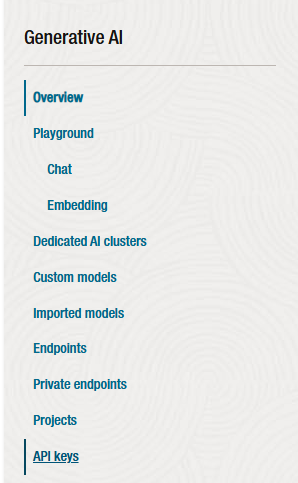

Set the compartment that you want to use for this work, then copy the compartment name for later use.

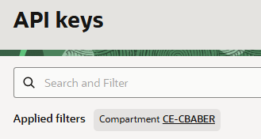

Click **Create API Key** and complete the form.

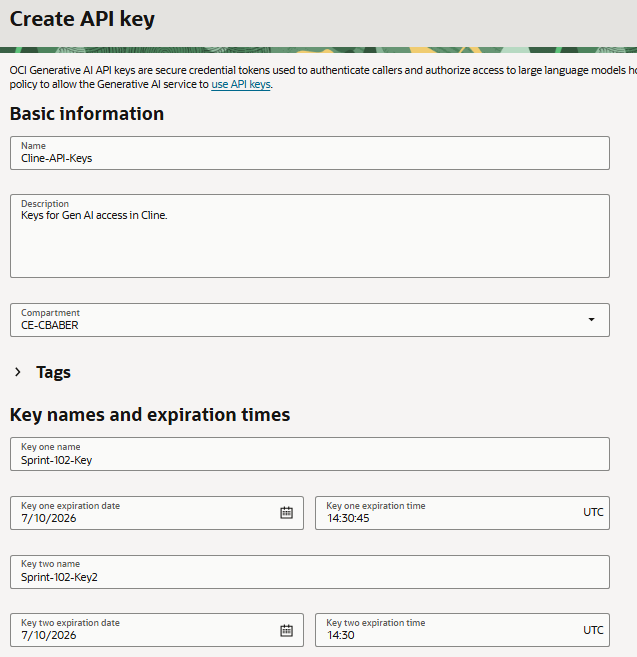

Copy your API key. It is shown only once.

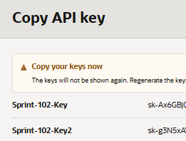

Copy the OCID for your newly created API key and save it for future reference.

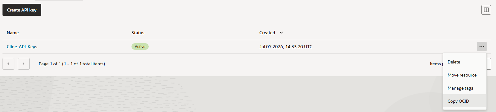

## 2. Create an IAM Policy

Create a policy statement that allows your selected group or principal to access Oracle Generative AI in the target compartment by using the newly created API key.

To get started, confirm that you have selected the correct compartment on the policy screen. In this example, the policy is created in the root compartment and scoped to the Generative AI API key created earlier.

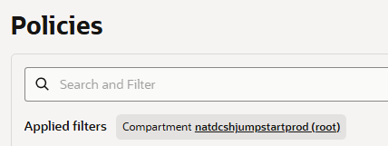

Click **Create Policy**, then enter the following name:

```text
AI-Cline-Access
```

Use the following description:

```text
Policy to enable access to GenAI keys
```

Enter manual mode, then paste and edit the policy below.

```text
allow any-user to use generative-ai-chat in compartment <compartment-name> where ALL {request.principal.type='generativeaiapikey', request.principal.id='<generative-ai-api-key-ocid>'}
```

Replace the placeholders with your actual values:

- `<compartment-name>`: The compartment name you copied earlier.
- `<generative-ai-api-key-ocid>`: The OCID for the API key you created.

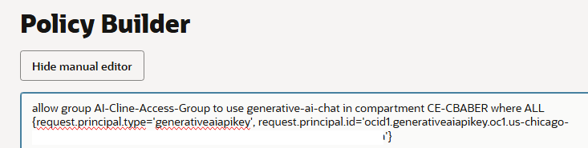

## 3. Configure Cline in Visual Studio Code

This step assumes that Visual Studio Code and the Cline extension are already installed.

Look at the OCID you copied earlier. It includes a region, such as `us-chicago-1` or `us-ashburn-1`. Copy that region value.

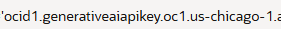

Paste the region into the endpoint URL format below:

```text
https://inference.generativeai.<region>.oci.oraclecloud.com/20231130/actions/v1
```

For example, if your region is `us-chicago-1`, your endpoint would be:

```text
https://inference.generativeai.us-chicago-1.oci.oraclecloud.com/20231130/actions/v1
```

Open Cline and click the gear icon.

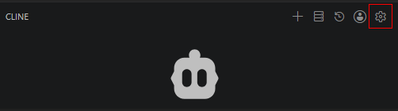

Select **OpenAI Compatible API**.

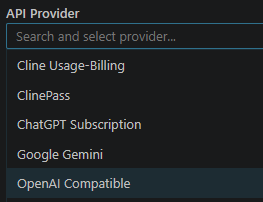

Paste in the endpoint URL you created earlier. Then enter the model you want to use and the API key you generated earlier.

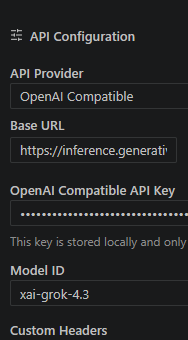

Click **Done**, then test Cline.

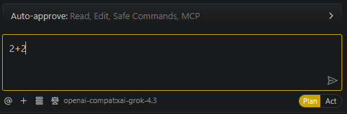

## 4. Find Available Models

The models available to you are listed in the Oracle Generative AI playground for your selected region.

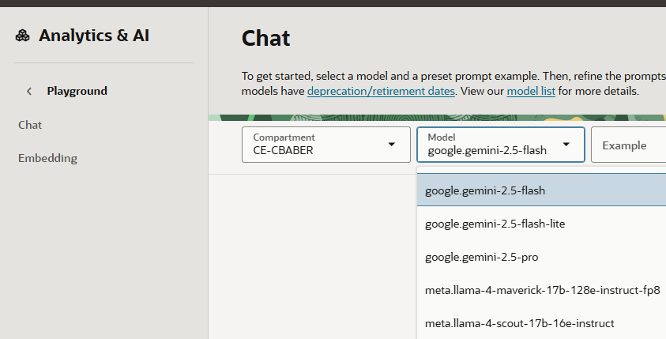

## Troubleshooting Tips

- Make sure the endpoint region matches the region where your Oracle Generative AI resources and API key are available.
- Confirm that the IAM policy uses the correct compartment name and API key OCID.
- Verify that the selected model is available in your region.
- If Cline cannot connect, regenerate or re-enter the API key and confirm there are no extra spaces.
