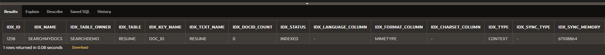
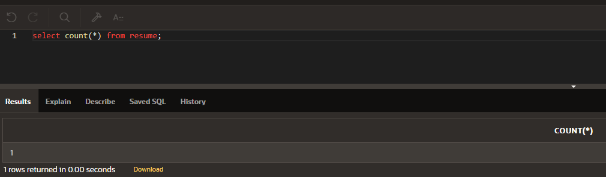
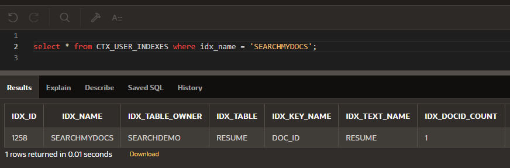

## This file contains some sample code on how to quickly tell how many documents have been indexed by Oracle Text, if any are still in the pending state.

- First we will query to see the tables with existing Oracle Text indexes. Notice the column IDX_DOCID_COUNT represents the number of documents currently indexed. See Oracle Text views for full spec. [https://docs.oracle.com/en/database/oracle/oracle-database/21/ccref/oracle-text-views.html](https://docs.oracle.com/en/database/oracle/oracle-database/21/ccref/oracle-text-views.html)


```
select * from CTX_USER_INDEXES where idx_name = 'SEARCHMYDOCS';
```

- Next we will query out table to find out the number of documents.

```
select count(*) from resume;
```

- To index the documents we need to run the following command.
```
alter index SEARCHMYDOCS rebuild online noparallel;
```
or
```
CTX_DDL.SYNC_INDEX('searchMyDocs', '5M');
```

- Requery the CTX_USER_INDEXES view to see the number of indexed docs.

```
select * from CTX_USER_INDEXES where idx_name = 'SEARCHMYDOCS';
```

- To figure out the number of documents that need to be indexed issue the following query.
```
select  (select count(*) from resume where resume is not null) - IDX_DOCID_COUNT "Documents to be Indexed" from CTX_USER_INDEXES where idx_name = 'SEARCHMYDOCS';
```

- To see number of deletes from index
```
select  count(*) from DR$SEARCHMYDOCS$N
```
