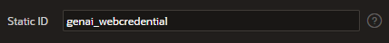
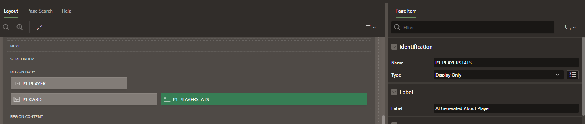
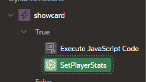
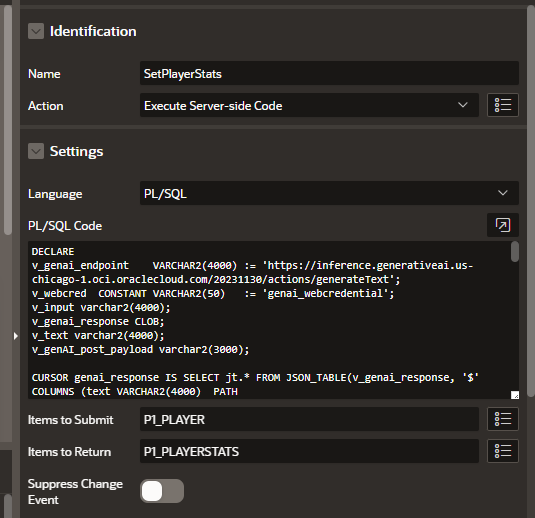

## Enhancing APEX Apps Dynamic Action Gen AI Calls

- I encourage you to watch the following video(s) and reference this blog before attempting to follow the technical path below. 
[]()

[How to Dynamically Show a Image on Select List Change without Page Submit in Oracle APEX](https://www.youtube.com/watch?v=MpxrqEbpgc8&list=PLsnBif_-5JnA8Hzvp8e1bQ3fo6VEvYEB0&index=16&pp=gAQBiAQB) 

[APEX Meets Gen AI](https://blogs.oracle.com/apex/post/building-innovative-qa-experiences-oracle-apex-meets-oci-generative-ai)

At the time of this recording the genAI service was only available in the chicago region. The solution shown leveraged ATP free tier in Ashburn along with genAI in chicago in another tennancy. There are other potential ways this could be accomplished, Select AI for example. We chose to leverage the genAI service through a Web Credential and enhance a APEX application as it feels like most organizations in time will want to choose and fine tune the LLM model that best fits there needs in time. Not everything will be documented in this particular markdown page, given the length of the video. However I will include enough sample code to enable you to follow along if you have an existing APEX workspace, application and developer priviledges. You will also need access to the OCI Gen AI service. 

-- The table leveraged to generate the select list in this example is, you can enter any baseball player name and image url to test:
```
  CREATE TABLE "PLAYERS" 
   (	"ID" NUMBER, 
	"PLAYERNAME" VARCHAR2(200), 
	"CARD_URL" VARCHAR2(600), 
	 CONSTRAINT "PLAYERS_PK" PRIMARY KEY ("ID")
  USING INDEX  ENABLE
   ) ;

  CREATE OR REPLACE EDITIONABLE TRIGGER "BI_PLAYERS" 
  before insert on "PLAYERS"               
  for each row  
begin   
  if :NEW."ID" is null then 
    select "PLAYERS_SEQ".nextval into :NEW."ID" from sys.dual; 
  end if; 
end; 

/
ALTER TRIGGER "BI_PLAYERS" ENABLE;
```

-- The query for the select list page item is: 
```
select id || ' '|| playername, card_url from players
```

-- The static content base64 content for the blank image of 1 pixels is:
```
data:image/png;base64,iVBORw0KGgoAAAANSUhEUgAAAAEAAAABCAYAAAAfFcSJAAAADUlEQVR42mNk+P+/HgAFhAJ/wlseKgAAAABJRU5ErkJggg==
```

-- The dynamic action javascript is below, you will need to change your variable names: 
```
let holder = apex.item("P8_PLAYER").getValue();
console.log("Holder is "+holder);
$("#P8_CARD").attr("src", holder);
```

-- Gather core tennancy information for creation of a web credential.
```
Compartment ID: 
OCI User ID: 
OCI Tennancy ID: 
OCI Public Key Fingerprint: 
OCI Private Key:
```

--Create a new Web Credential and record the web credintial static id. 


```
Web Credential Static ID: 
```

-- Add a new Display Only Item to your page. Provide the Label "AI Generated About Player"


-- Add a second action under the action that sets the image to the player selected in the select list. 





-- Insert the Code Below into the action. You will need to swap in your web credential, compartment id and update your variable names. Once you understand the code block below and it works for you it may be good comment out the apex.debug lines.  
```
DECLARE
v_genai_endpoint    VARCHAR2(4000) := 'https://inference.generativeai.us-chicago-1.oci.oraclecloud.com/20231130/actions/generateText'; 
v_webcred  CONSTANT VARCHAR2(50)   := '<add web credential static id>'; 
v_input varchar2(4000);
v_genai_response CLOB;
v_text varchar2(4000);
v_genAI_post_payload varchar2(3000);

CURSOR genai_response IS SELECT jt.* FROM JSON_TABLE(v_genai_response, '$' COLUMNS (text VARCHAR2(4000)  PATH '$.inferenceResponse[0].generatedTexts[0].text' )) jt; 

BEGIN
select 'What is'||playername||s career batting average?' into v_input from players where card_url = :P1_PLAYER;

--:P1_PLAYERSTATS := v_input;

v_genAI_post_payload := '{ 
            "inferenceRequest": {
                    "runtimeType": "COHERE",
                     "prompt": "'||v_input||'",
                     "maxTokens": 200,
                     "temperature": 0.3,
                     "numGenerations": 1,
                     "returnLikelihoods": "GENERATION",                     
                     "isStream": false
            }, 
            "servingMode": { 
                "servingType": "ON_DEMAND",
                "modelId": "cohere.command-light"
            }, 
            "compartmentId": "<add compartment id>"
    }';

-- Comment out debug later. For learning lets take a look at what is happening. 
apex_debug.message(p_message => 'Example GenAI call. Lets Check our input variables:',p_force => TRUE);
apex_debug.message(p_message => 'REST Post Payload set in variable v_genAI_post_payload: '||CHR(13) || v_genAI_post_payload, p_force => TRUE);

  if v_input is not null then
        --set headers to return payload as json
        apex_web_service.g_request_headers.DELETE; 
        apex_web_service.g_request_headers(1).name  := 'Content-Type'; 
        apex_web_service.g_request_headers(1).value := 'application/json';  

         v_genai_response := apex_web_service.make_rest_request 
           (p_url                  => v_genai_endpoint, 
            p_http_method          => 'POST', 
            p_body                 => v_genAI_post_payload, 
            p_credential_static_id => v_webcred); 

--View full response payload
apex_debug.message(p_message => 'REST Response Payload set in variable v_genai_response: ' ||CHR(13)|| v_genai_response, p_force => TRUE);

--Output and Test your cursor query. Please note to run the query addition ''  are required around the response payload.
apex_debug.message(p_message => 'SQL Query generated for :'||CHR(13)||'SELECT jt.* FROM JSON_TABLE('''||v_genai_response||''', ''$'' COLUMNS(text VARCHAR2(4000) PATH ''$.inferenceResponse[0].generatedTexts[0].text'' )) jt', p_force => TRUE);

 for line in genai_response Loop
           v_text := v_text || line.text;           
 end loop;
 :P1_PLAYERSTATS := v_text;

end if;

 EXCEPTION
  WHEN OTHERS THEN
  apex_debug.message(p_message => 'Error caught in exception block of process calling genAI', p_force => TRUE);

END;
```

- Show how to extract other values from the JSON. Grab Model ID
```
 model_id VARCHAR2(4000) PATH '$.inferenceResponse[0].generatedTexts[0].id'
```


- Link to jsonl validator
https://jsonlines.org/validator/