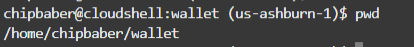

## How to connect OCI shell console to ATP and Access APEX Schema
Are you curious on how to connect to your autonmous database from the OCI shell console? Perhaps you have an APEX schema and want to run SQL*PLus to look at the data inside autonomous? The fastest way to easily connect via SQL*Plus to Oracle Autonmous Database for quick developed access is through the OCI Shell Console. This video is designed for developed to show you how in just 3 minutes you can download your autonomous database wallet, modify the sqlnet.ora and .bash_profile then login via SQL*Plus and begin to query your database. This video assumes your autonomous database is already provisioned. 

Please watch this video before going through the Code Samples below []()

- Create a wallet directory and navigate into the directory folder.
```
mkdir wallet
cd wallet
```

- Build our your oci command line statement to download your wallet file by collecting the ocid of the autonmous database and entering your admin password.

```
oci db autonomous-database generate-wallet --autonomous-database-id <add ocid of adb> --file SLUGGERSAPEX.zip --password  'add your password'
```

- unzip the wallet file and get your current location.
```
unzip SLUGGERSAPEX.zip
pwd 
```


- alter the sqlnet.ora file so the directory points to your wallet location. In this example it is /home/chipbaber/wallet 
```
vi sqlnet.ora
```

- Modify your bash profile so it remembers your sqlnet.ora location
```
cd ..
vi .bash_profile
```

- add in the lcoation to your wallet and save your changes. 
```
export TNS_ADMIN=/home/chipbaber/wallet
```

- Refresh your bash_profile. 
```
. .bash_profile
```

- View the various connect string options by looking at your tnsnames.ora file. In this example we will use the sluggersapex_low connection. 
```
cd wallet
more tnsnames.ora
```

- connect to your database as the user you desire and test a query. 
```
sqlplus admin@<insert your connect string>
```


