## XML Ingestion through ORDS REST API

In this example we will showcase how Oracle ATP can consume XML files through ORDS and store natively inside the database insde the XML data type. We will also show some basic queries on the information. The ORDS REST service will ingest the .xml file as a binary file and convert row by row to a CLOB form that can be inserted into the XMLtype in the DB.

- Login to APEX and navigate to SQL Workshop. Execute the following SQL to create the stage_xml table.


```
CREATE TABLE  "STAGE_XML"
   (	"XML_COL" "SYS"."XMLTYPE" ,
	"PROCESSED" CHAR(1) COLLATE "USING_NLS_COMP" NOT NULL ENABLE,
	"ID" NUMBER NOT NULL ENABLE
   )  DEFAULT COLLATION "USING_NLS_COMP"
/

CREATE OR REPLACE EDITIONABLE TRIGGER  "xml_stage_pk"
  before insert on "STAGE_XML"               
  for each row  
begin   
  if :NEW."ID" is null then
    select "STAGE_XML_SEQ".nextval into :NEW."ID" from sys.dual;
  end if;
end;

/
ALTER TRIGGER  "xml_stage_pk" ENABLE
/
```

- Create a new module with the following naming convention.

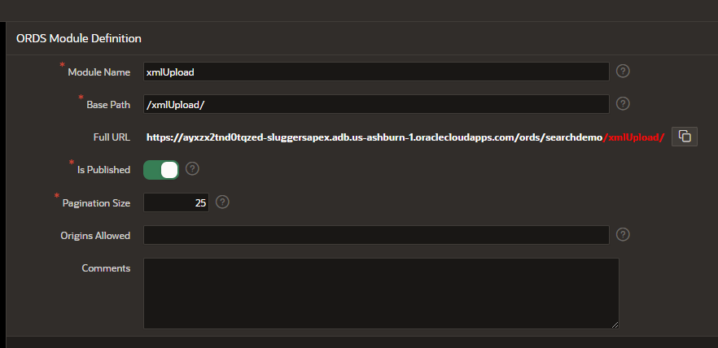

- Create a template with the following information.

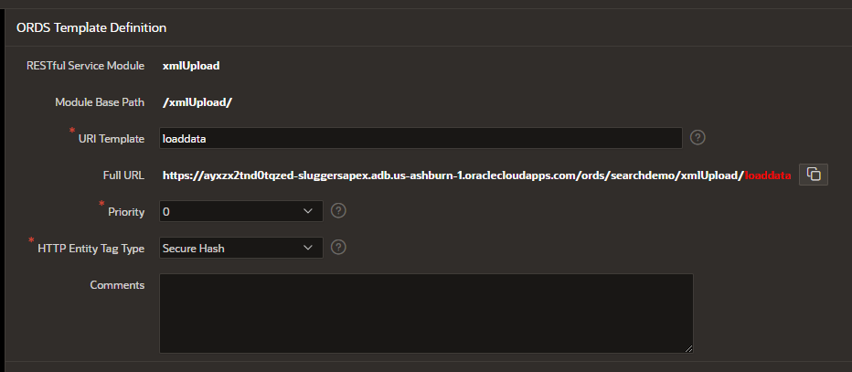

- Create a handler.


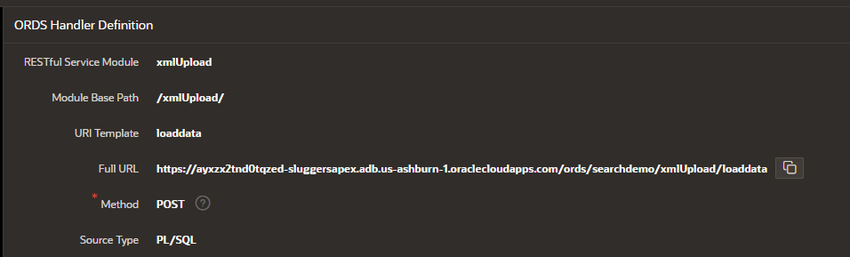


- Add mime types for the XML Ingestion

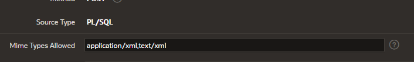

```
application/xml,text/xml
```

Example Comments
```
Post method for xml upload via rest with conversion to xml and insertion into ADB as XMLtype.
```
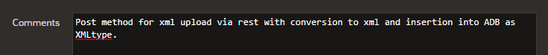

- Add the following PL/SQL code to ingest the XML as a binary file and convert to CLOB for insertion into the table as the XML type.

```
declare
t1 timestamp := systimestamp;
t2 timestamp;
v_content BLOB; -- Uploading to ORDS as a BLOB in binary
blob_length INTEGER;
v_xml clob;
pos INTEGER := 1;
buf INTEGER := 32767; -- max buffer size per CLOB pull in APEX
v_temp VARCHAR2(32767);
v_rowid VARCHAR2(100);


BEGIN
-- put raw blob into variable
v_content := :BODY;
blob_length := DBMS_LOB.GETLENGTH(v_content);
--if empty xml file pushed into REST throw error
IF v_content IS NULL
  THEN
      RAISE NO_DATA_FOUND;
  ELSE
--create a temp clob
DBMS_LOB.CREATETEMPORARY(v_xml, TRUE);

/*Loop through the blob to form the CLOB*/
WHILE pos < blob_length
LOOP
--if the lenght of the file is shorter than the length of the buffer then swap in buffer length.
if (blob_length < buf) THEN
buf := blob_length;
end if;
-- convert blob raw to varchar and build a CLOB temp variable.
v_temp := UTL_RAW.CAST_TO_VARCHAR2(DBMS_LOB.SUBSTR(v_content, buf, pos));
DBMS_LOB.WRITEAPPEND(v_xml, LENGTH(v_temp), v_temp);
-- move the buffer offset
pos := pos + buf;
END LOOP;

/*Insert into ADB*/
insert into stage_xml (XML_COL, PROCESSED) values (xmltype.createxml(v_xml), 'N') RETURNING ROWID INTO v_rowid;

--return post response
owa_util.status_line(201, '', false);
owa_util.mime_header('application/json', true);
t2 := systimestamp; --get end time
htp.prn('{"status": "XML Inserted","Row ID":"'||v_rowid||'","Blob File Length Received":"'||blob_length||'","Clob File on Convert":"'||DBMS_LOB.GETLENGTH(v_xml)||',"Elapsed Processing Time(Seconds)":"'||TO_CHAR(t2-t1, 'SSSS.FF')||'"}');
--empty out the Clob
 v_xml := EMPTY_CLOB();
END IF;

EXCEPTION
      WHEN NO_DATA_FOUND THEN
            owa_util.status_line(411, 'Null XML File on REST POST Error', false);
            owa_util.mime_header('application/json', true);
            htp.prn('{"error": "411 - Null XML File on REST POST Error","message":"No xml file found in post request. Please return including the binary data in your post call."}');
            v_xml := EMPTY_CLOB();
      WHEN OTHERS
      THEN
            owa_util.status_line(412, 'Unknown Exception Error', false);
            owa_util.mime_header('application/json', true);
            htp.prn('{"error": "412 - Unknown Exception Error","status": "message","Something went wrong in the code, here is the sqlerr response:"'||SQLERRM||'}');
             v_xml := EMPTY_CLOB();

end;
```

-- Navigate back to SQL Workshop, SQL Commands and execute the following query.

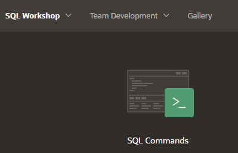

```
select * from stage_xml
```

-- Upload the sample xml documents in postman. order1.xml, order2.xml. Please reference this video on how to upload binary documents via postman. [Video](https://youtu.be/rnqGQrhvhLA)

-- Run the query above again to see the xml documents.

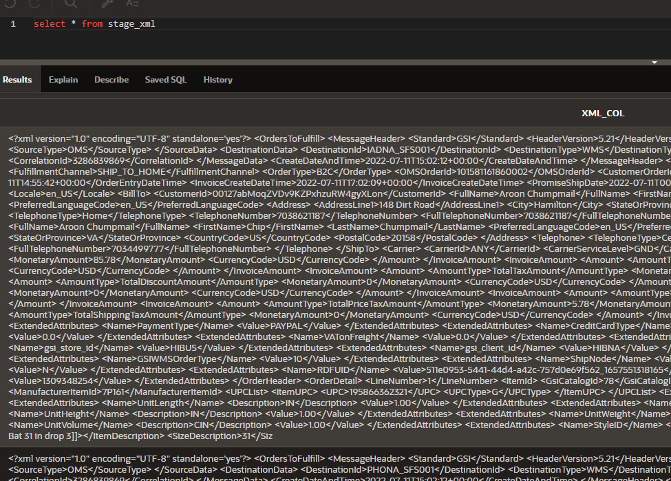

-- In the raw form this information can look complicated, however with relative ease we can query and create views to view the xml information in this form however we require. Create the following views, then query the information to get a better feel for how it works.

-- Example query to view the Message Header information in the XML documents.

```
create or replace view v_messageheader as
SELECT ID, MESSAGEHEADER.* FROM STAGE_XML, XMLTABLE('/OrdersToFulfill'  PASSING STAGE_XML.xml_col
    COLUMNS
        std VARCHAR2(30) PATH 'MessageHeader/Standard',
        headerversion NUMBER(6,2) PATH 'MessageHeader/HeaderVersion',
        VersionReleaseNumber NUMBER(6,2) PATH 'MessageHeader/VersionReleaseNumber',
        SourceId varchar2(30) PATH 'MessageHeader/SourceData/SourceId',
        SourceType varchar2(30) PATH 'MessageHeader/SourceData/SourceType',
        DestinationId varchar2(30) PATH 'MessageHeader/DestinationData/DestinationId',
        DestinationType varchar2(30) PATH 'MessageHeader/DestinationData/DestinationType',
        EventType varchar2(30) PATH 'MessageHeader/EventType',
        MessageId varchar2(30) PATH 'MessageHeader/MessageData/MessageId',
        CorrelationId varchar2(30) PATH 'MessageHeader/MessageData/CorrelationId',
        CreateDateAndTime varchar2(30) PATH 'MessageHeader/CreateDateAndTime'
        ) MESSAGEHEADER
```
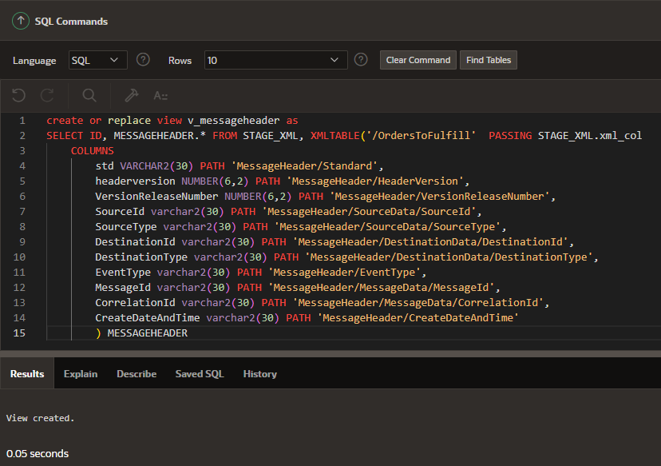

-- Execute the query
```
select * from v_messageheader
```

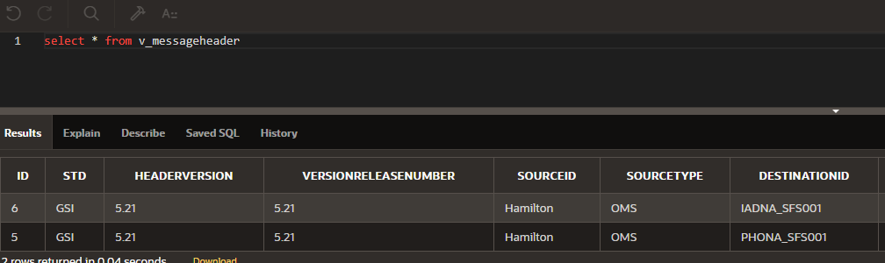

-- Build the Order Header View

```
create or replace view v_orderheader as
SELECT ID, ORDERHEADER.* FROM STAGE_XML, XMLTABLE('/OrdersToFulfill'  PASSING STAGE_XML.xml_col COLUMNS
MessageId varchar2(30) PATH 'MessageHeader/MessageData/MessageId',
CATALOGID   VARCHAR2(255) PATH 'Order/OrderHeader/ExtendedAttributes[Name="CatalogId"]/Value',
CLIENTID       VARCHAR2(255) PATH 'Order/OrderHeader/ClientId',
CUSTOMERORDERID VARCHAR2(255) PATH 'Order/OrderHeader/CustomerOrderId',
FACILITYID  VARCHAR2(255) PATH 'Order/OrderHeader/FacilityId',
FULFILLMENTCHANNEL VARCHAR2(255) PATH 'Order/OrderHeader/FulfillmentChannel',
ORDERTYPE         VARCHAR2(255) PATH 'Order/OrderHeader/OrderType',
OMSORDERID  VARCHAR2(40)  PATH 'Order/OrderHeader/OMSOrderId',
SPLITORDERINDICATOR   VARCHAR2(255)  PATH 'Order/OrderHeader/SplitOrderIndicator',
ORDERENTRYDATETIME VARCHAR2(255) PATH 'Order/OrderHeader/OrderEntryDateTime',
INVOICECREATEDATETIME  VARCHAR2(255) PATH 'Order/OrderHeader/InvoiceCreateDateTime',
PROMISESHIPDATE      VARCHAR2(255)  PATH 'Order/OrderHeader/PromiseShipDate',
PROMISERECEIPTDATE  VARCHAR2(255) PATH 'Order/OrderHeader/PromiseReceiptDate',
LOCALE   VARCHAR2(255) PATH 'Order/OrderHeader/Locale',
GSI_STORE_ID       VARCHAR2(255) PATH 'Order/OrderHeader/ExtendedAttributes[Name="gsi_store_id"]/Value',
GSI_CLIENT_ID   VARCHAR2(255)  PATH 'Order/OrderHeader/ExtendedAttributes[Name="gsi_client_id"]/Value'
) ORDERHEADER
```

-- Query the view

```
Select * from v_orderheader
```
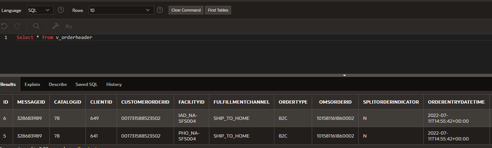


-- Create a Billto view.

```
create or replace view v_billto as
SELECT ID, BILLTO.* FROM STAGE_XML, XMLTABLE('/OrdersToFulfill'  PASSING STAGE_XML.xml_col COLUMNS
MessageId varchar2(30) PATH 'MessageHeader/MessageData/MessageId',
CUSTOMERID  VARCHAR2(255) PATH 'Order/OrderHeader/BillTo/CustomerId',
FULLNAME    VARCHAR2(255) PATH 'Order/OrderHeader/BillTo/FullName',
FIRSTNAME   VARCHAR2(255) PATH 'Order/OrderHeader/BillTo/FirstName',
LASTNAME   VARCHAR2(255)  PATH 'Order/OrderHeader/BillTo/LastName',
EMAILADDRESS  VARCHAR2(255) PATH 'Order/OrderHeader/BillTo/EmailAddress',
PREFERREDLANGUAGECODE   VARCHAR2(255) PATH 'Order/OrderHeader/BillTo/PreferredLanguageCode'
) BillTO
```

-- Select from the billto view
```
select * from v_billto
```
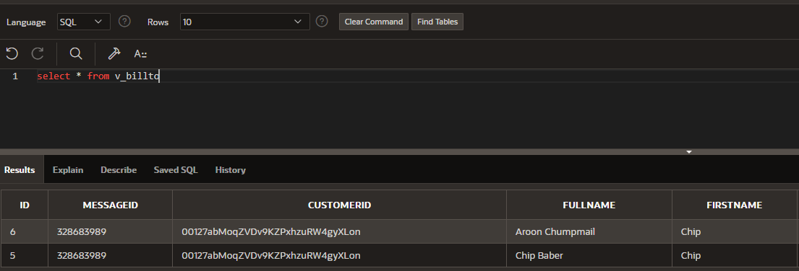

-- How to select and display repeating xml elements with a primary key. In this example we will display the ExtendedAttributes repeating elements.

```
create or replace view v_extendedattributes as
SELECT ID, m.messageID, m.customerorderid, m.OMSORDERID, ea.name, ea.description, ea.value
 FROM STAGE_XML, XMLTABLE('/OrdersToFulfill'  PASSING STAGE_XML.xml_col COLUMNS
MessageId varchar2(30) PATH 'MessageHeader/MessageData/MessageId',
CUSTOMERORDERID VARCHAR2(255) PATH 'Order/OrderHeader/CustomerOrderId',
OMSORDERID  VARCHAR2(40)  PATH 'Order/OrderHeader/OMSOrderId'
) m,
XMLTABLE('/OrdersToFulfill/Order/OrderDetail/ItemId/ExtendedAttributes'  PASSING STAGE_XML.xml_col COLUMNS
name varchar2(30) PATH 'Name',
description varchar2(30) PATH 'Description',
value varchar2(30) PATH 'Value'
) ea
```

-- Query the view
```
select * from v_extendedattributes
```
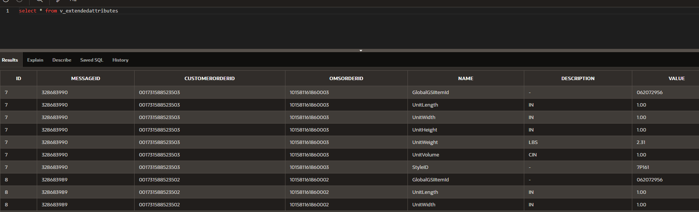

-- Multi-row invoice query

```
create or replace view invoiceamount as
SELECT ID, m.messageID, m.customerorderid, m.OMSORDERID, ia.amounttype, ia.monetaryamount, ia.currencycode
 FROM STAGE_XML, XMLTABLE('/OrdersToFulfill'  PASSING STAGE_XML.xml_col COLUMNS
MessageId varchar2(30) PATH 'MessageHeader/MessageData/MessageId',
CUSTOMERORDERID VARCHAR2(255) PATH 'Order/OrderHeader/CustomerOrderId',
OMSORDERID  VARCHAR2(40)  PATH 'Order/OrderHeader/OMSOrderId'
) m,
XMLTABLE('/OrdersToFulfill/Order/OrderHeader/InvoiceAmount'  PASSING STAGE_XML.xml_col COLUMNS
amounttype varchar2(30) PATH 'Amount/AmountType',
monetaryamount varchar2(30) PATH 'Amount/MonetaryAmount',
currencycode varchar2(30) PATH 'Amount/CurrencyCode'
) ia
```

-Query the invoice.
```
select * from invoiceamount
```
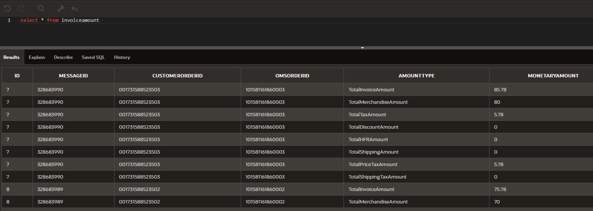
